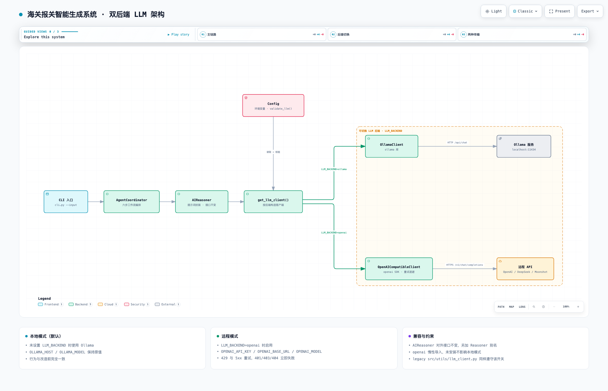

# Customs Declaration Report Generator

[简体中文](README.md) | **English**

An LLM-powered system that turns CSV/Excel customs data into Word/Excel declaration documents. It supports **two switchable LLM backends**: a **local Ollama** server and any **remote OpenAI-compatible API** (OpenAI, DeepSeek, Moonshot, vLLM, ...).

> 📖 For AI assistants and contributors, see [AGENT.md](AGENT.md).

## Features

- 🤖 **LLM-powered processing**: works with local Ollama or a remote API (OpenAI / DeepSeek / Moonshot, ...)
- 🔀 **Switchable backend**: flip between backends with the `LLM_BACKEND` environment variable; defaults to local Ollama
- 📊 **Multi-format input**: CSV, XLSX, and XLS files
- 🔍 **Data validation**: automatically detects data errors and inconsistencies
- 📝 **Report generation**: produces professional declarations, packing lists, invoices, and more
- 🔄 **AI-assisted correction**: helps fix data problems
- 📈 **Data analysis**: statistical analysis and data previews

## Architecture



Backend selection is confined to a single place: business code depends only on
`AIReasoner`, and the `get_llm_client()` factory decides whether to instantiate
`OllamaClient` (local) or `OpenAICompatibleClient` (remote) based on `LLM_BACKEND`.
As a result, switching between the two modes requires **no changes** to
`AgentCoordinator` or any of its callers.

- **Interactive diagram** (theme switching, pan/zoom, search, focus, export): [docs/llm-backend-architecture.html](docs/llm-backend-architecture.html)
- **Diagram source** (Archify JSON — edit and regenerate): [docs/llm-backend-architecture.json](docs/llm-backend-architecture.json)

```
CLI entry → AgentCoordinator → AIReasoner → get_llm_client()
                                              ├─ LLM_BACKEND=ollama → OllamaClient → Ollama server (localhost:11434)
                                              └─ LLM_BACKEND=openai → OpenAICompatibleClient → remote API
```

> ℹ️ The diagram is generated with [Archify](https://github.com/tt-a1i/archify). After editing
> `docs/llm-backend-architecture.json`, re-run `validate` and `deliver` to update the HTML
> (the HTML is a single self-contained file you can open directly in a browser).

## Quick Start

### 1. Install dependencies

```bash
pip install -r requirements.txt
```

### 2. Make sure Ollama is running

```bash
# Start the Ollama service
ollama serve

# Pull the model (optional; defaults to qwen3.5:27b)
ollama pull qwen3.5:27b
```

### 3. Run

```bash
# Process a single file
python cli.py --input data/sample.csv

# Process multiple files
python cli.py --input data/file1.csv data/file2.csv

# Custom output directory
python cli.py --input data/sample.csv --output my_output/

# Verbose output
python cli.py --input data/sample.csv --verbose
```

### 4. Configuration

Configure via environment variables (or copy `.env.example` to `.env` and fill it in).

#### Mode 1: Local Ollama (default)

With no variables set, the system runs locally and behaves exactly as before:

```bash
# Ollama settings
export OLLAMA_HOST=http://localhost:11434
export OLLAMA_MODEL=qwen3.5:27b
export OLLAMA_TIMEOUT=120

# Log level
export LOG_LEVEL=DEBUG
```

#### Mode 2: Remote LLM (OpenAI-compatible API)

First install the dependency required for remote calls:

```bash
pip install "openai>=1.0.0"
```

Then set the following environment variables:

```bash
export LLM_BACKEND=openai
export OPENAI_API_KEY=sk-xxxxxxxx          # Required; the program exits at startup if missing
export OPENAI_BASE_URL=https://api.openai.com/v1
export OPENAI_MODEL=gpt-4o

python cli.py --input data/sample.csv
```

Common provider settings:

| Provider | `OPENAI_BASE_URL` | `OPENAI_MODEL` example |
|---|---|---|
| OpenAI | `https://api.openai.com/v1` | `gpt-4o` |
| DeepSeek | `https://api.deepseek.com/v1` | `deepseek-chat` |
| Moonshot (Kimi) | `https://api.moonshot.cn/v1` | `moonshot-v1-8k` |
| Local vLLM / LM Studio | `http://localhost:8000/v1` | your model name |

For example, with DeepSeek:

```bash
export LLM_BACKEND=openai
export OPENAI_API_KEY=sk-your-key
export OPENAI_BASE_URL=https://api.deepseek.com/v1
export OPENAI_MODEL=deepseek-chat
```

#### Switching back to local mode

```bash
unset LLM_BACKEND                 # or: export LLM_BACKEND=ollama
```

#### Inspecting the active configuration

```bash
python cli.py --print-config      # API keys are masked automatically
```

#### Full list of settings

| Variable | Default | Description |
|---|---|---|
| `LLM_BACKEND` | `ollama` | `ollama` or `openai` |
| `OLLAMA_HOST` | `http://localhost:11434` | Local server address |
| `OLLAMA_MODEL` | `qwen3.5:27b` | Local model |
| `OLLAMA_TIMEOUT` | `120` | Local timeout (seconds) |
| `OPENAI_API_KEY` | empty | Remote API key (required in `openai` mode) |
| `OPENAI_BASE_URL` | `https://api.openai.com/v1` | Remote service address |
| `OPENAI_MODEL` | `gpt-4o` | Remote model |
| `OPENAI_TIMEOUT` | `120` | Remote timeout (seconds) |
| `OPENAI_FALLBACK_MODEL` | empty | Optional fallback model; empty disables fallback |
| `LLM_MAX_RETRIES` | `3` | Retry attempts (429 / 5xx / timeout) |
| `LLM_RETRY_BACKOFF` | `1.0` | Retry backoff base (seconds) |
| `LOG_LEVEL` | `INFO` | Log level |

#### Retries and error handling

- **429 rate limits / 5xx / timeouts** are retried automatically, up to `LLM_MAX_RETRIES`;
- **401 / 403 / 404 / 400** are **not** retried — they fail immediately with the HTTP status code in the log;
- If `LLM_BACKEND=openai` is set without `OPENAI_API_KEY`, the program **fails at startup** with a clear fix suggestion.

## Data Formats

Two input formats are supported.

### Format 1: Flat (one product per row)

```csv
Exporter,Importer,Invoice No,HS Code,Product Name,Quantity,Unit,Unit Price,Weight,Origin
Test Company,Test Importer,INV-001,85285210,Monitor,100,PCS,100.00,5.0,CN
```

### Format 2: Key-value pairs

```csv
field,value
exporter,Test Company
importer,Test Importer
invoice_number,INV-001
products,"[{'hs_code': '85285210', 'product_name': 'Monitor', 'quantity': 100, 'unit': 'PCS', 'unit_price': 100.00, 'weight': 5.0, 'origin': 'CN'}]"
```

## Project Layout

```
custom_agent_project/
├── src/                    # Source code
│   ├── __init__.py
│   ├── data/               # Data layer
│   │   ├── __init__.py
│   │   ├── loader.py       # Data loading
│   │   ├── validator.py    # Data validation
│   │   └── models.py       # Data models
│   ├── agent/              # Agent layer
│   │   ├── __init__.py
│   │   ├── coordinator.py  # Workflow orchestrator
│   │   ├── reasoning.py    # AI reasoning engine (aliased as Reasoner)
│   │   ├── llm_client.py   # LLM clients (Ollama / OpenAI-compatible)
│   │   └── prompts.py      # Prompt templates
│   ├── template/           # Template layer
│   │   ├── __init__.py
│   │   └── engine.py       # Document engine
│   └── utils/              # Utilities
│       ├── __init__.py
│       ├── config.py       # Configuration management
│       ├── llm_client.py   # Legacy LLM client (cache / fallback)
│       ├── llm_errors.py   # LLM exception types
│       ├── logger.py       # Logging setup
│       └── constants.py    # Constants
├── tests/                  # Tests
│   ├── test_agent.py
│   ├── test_data.py
│   ├── test_llm_client.py       # LLM unit tests (offline)
│   ├── test_llm_integration.py  # LLM integration tests (needs the openai package)
│   └── sample_data.csv
├── docs/                   # Architecture diagram
│   ├── llm-backend-architecture.html      # Interactive diagram (self-contained)
│   ├── llm-backend-architecture.json      # Archify source
│   └── architecture-preview.png           # Static preview used by the READMEs
├── cli.py                  # CLI entry point
├── requirements.txt        # Dependencies
├── README.md               # User docs (Simplified Chinese)
├── README.en.md            # User docs (English)
├── AGENT.md                # Technical notes for AI assistants / developers
├── CLAUDE.md               # Claude Code guidance
├── .env.example            # Environment variable template
├── .gitignore              # Git ignore rules
├── output/                 # Output directory
├── logs/                   # Log directory (gitignored)
└── templates/              # Template directory
```

## Testing

```bash
# Run the whole suite
pytest tests/ -v

# Run a specific test
pytest tests/test_agent.py -v

# LLM tests only (fully mocked: no network, no openai package required)
pytest tests/test_llm_client.py -v

# LLM integration tests (requires the real openai SDK; auto-skips if absent)
pip install "openai>=1.0.0"
pytest tests/test_llm_integration.py -v

# Coverage report
pytest tests/ --cov=src --cov-report=html
```

> ⚠️ Known pre-existing failures (unrelated to the LLM work): the `pytest tests/ -q`
> baseline is **64 passed / 7 failed / 7 skipped**. All 7 failures come from existing
> defects in `tests/test_data.py` and `tests/test_agent.py`. Treat that baseline as the
> reference when checking for regressions.

## Usage Examples

### Create test data

```python
# Create a CSV file
import pandas as pd

data = {
    "Exporter": ["Test Company"],
    "Importer": ["Test Importer"],
    "Invoice No": ["INV-001"],
    "HS Code": ["85285210"],
    "Product Name": ["Test Monitor"],
    "Quantity": [100],
    "Unit": ["PCS"],
    "Unit Price": [100.0],
    "Weight": [5.0],
    "Origin": ["CN"]
}

df = pd.DataFrame(data)
df.to_csv("test_data.csv", index=False)
```

### Process the data

```bash
python cli.py --input test_data.csv
```

### Inspect the results

```bash
# List generated files
ls output/

# Read the log
cat logs/customs_agent.log
```

## Error Handling

The system automatically detects:

- ❌ Missing required fields
- ❌ Malformed HS codes
- ❌ Negative quantities or prices
- ❌ Inconsistent units
- ⚠️ Data inconsistency warnings

## Extending

### Adding a new template

1. Create the template under `templates/`
2. Register it in `src/template/engine.py`
3. Add the corresponding prompt in `src/agent/prompts.py`

### Custom configuration

```python
from src.utils.config import Config

# Set the output directory
Config.set_output_dir("/path/to/output")

# Set the Ollama model
Config.set_ollama_model("qwen3.5:27b")

# Switch backends at runtime (equivalent to the LLM_BACKEND env var)
Config.set_llm_backend("openai")
Config.set_llm_model("deepseek-chat")

# Print the configuration (secrets are masked)
Config.print_config()
```

## Contributing

1. Fork the project
2. Create a feature branch
3. Commit your changes
4. Push to the branch
5. Open a Pull Request

## License

MIT License
